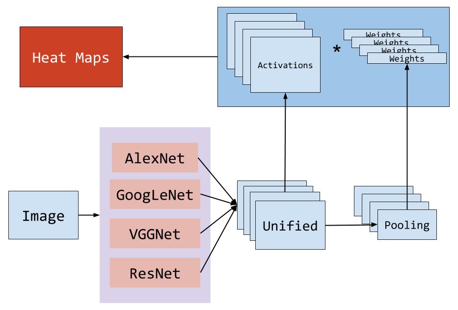

# ChestX-ray8: Hospital-scale Chest X-ray Database and Benchmarks on Weakly-Supervised Classification and Localization of Common Thorax Diseases

CVPR 2017

## Problem Definition

Given chest xray image, classify into 8 class.

- Since original data is image-paragraph pairs, we need to turn paragraph into tags by NLP.

## Method

Image will first put into 4 pretrained nets, and then unify as a transition layer.

* A = activation layer from transition layer,
* B = **weight layer** after pooling transition layer.
* Output heat maps = A * B

### Loss

Since data of classes is not balance, the loss will be weighted.
