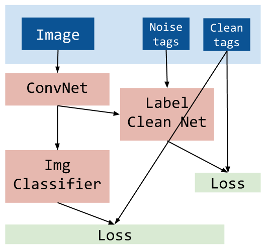
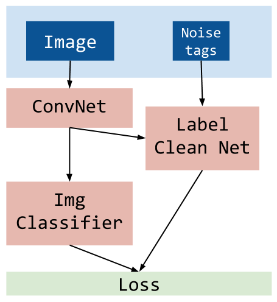

# Learning From Noisy Large-Scale Datasets With Minimal Supervision

CVPR 2017

## Poblem Definition

- Multi-label image classification
- Data: Most of the data has noise tags.

## Method

This method is greater than training and fine-tuning method.

3 Net:

- Generate feature from image: Image → Feature
- Turn noise tags into clean tags: (Feature, Noise tags) → Clean tags
- Generate clean tags from fature: Feature → Clean tags

### How to Train 

| Clean tags          | Noise tags          |
| --------------------| --------------------|
|  |  |
