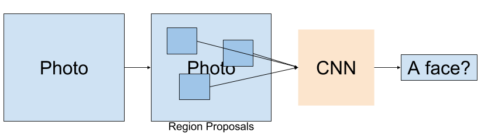
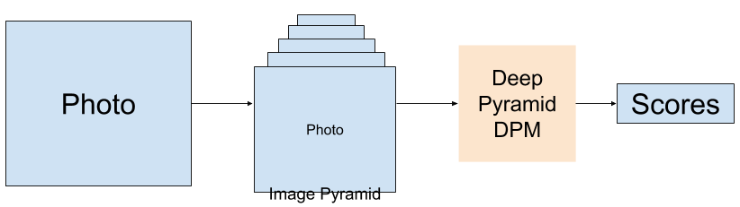
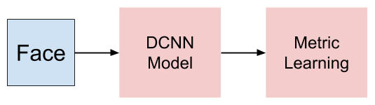
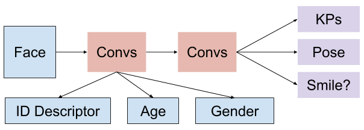

# Deep Learning for Understanding Faces

Source: Ranjan et al., “Deep Learning for Understanding Faces: Machines May Be Just as Good, or Better, than Humans”. IEEE Signal Processing Magazine 2018.

Deep learning part of face application

## Face Detection

* Region based: Generate a lot of regions which may include a face, and then check every region seperately.

  

* Sliding-window based: Make image into pyramid, and put it into Deep Pyramid DPM, output scores of every position.

  

## Get keypoint of face and face pose

* Model based: Learn model from face
* Cascaded regression based

## Identification and Verification

Mainly include two part:

* Feature Part: Given face, output a discriptor of face
* Metric: Given two face discriptor, output **distance**

### Feature

* restricted Boltzmann machines
* DNN
  * DeepFace: 9-layer DNN
  * DeepID + Joint Bayesian: Smaller DNN
  * FaceNet: CNN-based
  * VGGFace

### Metric

* Supervised:
  * Triplet Loss
* Unsupervised:
  * Learn clusters
  * Neighborhood Structure

## All in One

