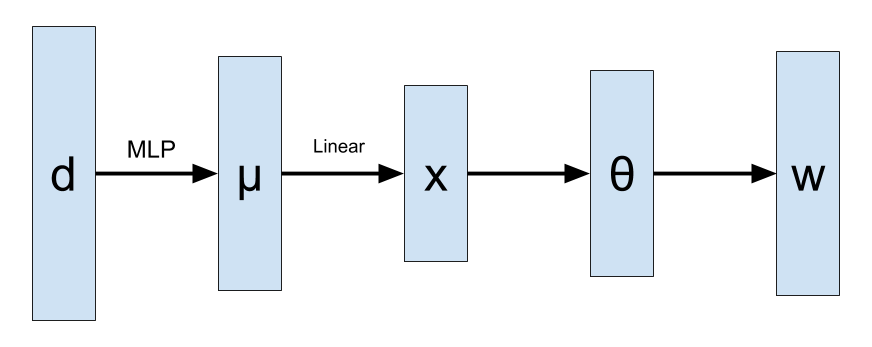

# Discovering Discrete Latent Topics with Neural Variational Inference

> Yishu Miao‚ Edward Grefenstette and Phil Blunsom. Discovering Discrete Latent Topics with Neural Variational Inference. ICML 2017.

Use Neural Network to model topic distribution.

## Method

1. Document $\rightarrow$ Latent Variable
2. Latent Variable $\rightarrow$ Topic

### Get Latent Variable 

$$
    \theta_d \sim \text{Dir}(\alpha) \sim G(x)
$$

Where $G$ is a Neural Network, $x \sim N(\mu, \sigma)$.

### Get Topic From Latent Variable

2 ways:

#### Gaussian Softmax (Baseline)

$$
\theta = \text{softmax}(W_1^Tx)
$$

#### Stick Breaking

$\eta = f_h(x)$

$$
    \theta_i = \eta_i \Pi_{j=1}^{i-1} (1-\eta_{i-1}) 
$$

### Conclude Topic

* ith topic lower bound:

$$
L_d^i \approx \sum_i \left[ \log(w_n|\beta^i, \theta^i) \right] - D_{KL}\left[q(x|d)||p(x)\right]
$$

* ith topic score:

$$
I = \frac{\sum_d [L_d^i - L_d^{i-1} ]}{\sum_d [L_d^i]}
$$

## Reference

* [Video: Report](https://vimeo.com/238222598)