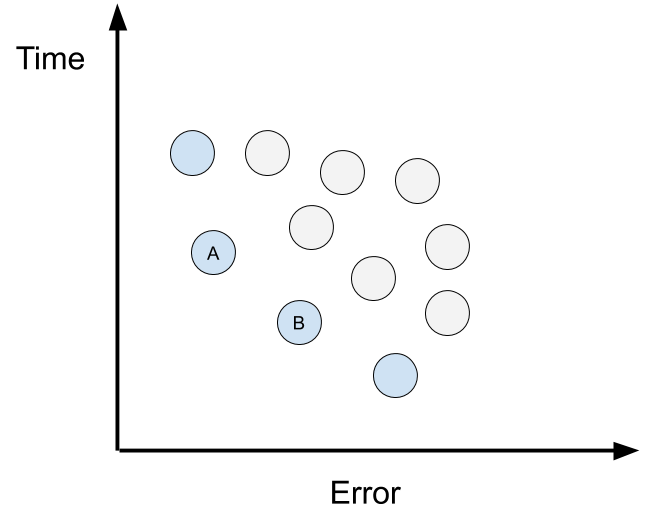
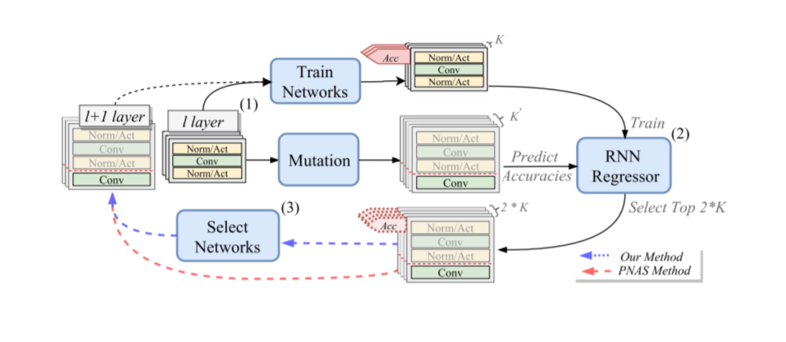

# DPP-Net: Device-aware Progressive Search for Pareto-optimal Neural Architectures

> Dong et al. DPP-Net — Device-Aware Progressive Search for Pareto-Optimal Neural Architectures, ECCV 2018.

## Introduction

Searching Pareto-optimal model structure over error and time.

### Pareto Optimal

Pareto Optimal is trying to find the points on multi-target graph which isn't dominate by any other solution.

For example, A and B are Pareto-Optimal over these points.

## Method

3 steps:
1. Train and Mutation
2. Update and Inference
3. Model Selection

## Result

| Model        | Top-1 | Time-M | Mem-M |
|--------------|-------|--------|-------|
| Densenet-121 | 25.02 | 1.611  | 466MB |
| MobileNetV2  | 28.3  | 0.777  | 270MB |
| DPP-Net      | 25.98 | 0.676  | 238MB |
