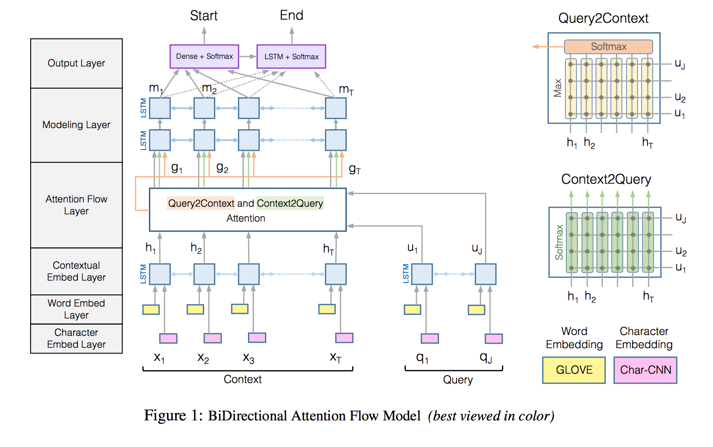

# Bidirectional Attention Flow for Machine Comprehension

> Bidirectional Attention Flow for Machine Comprehension, ICLR 2017

This paper proposed a QA model.

## Model

**Character Embedding Layer -> Word Embedding Layer -> Contextual Embedding Layer -> Attention Flow Layer -> Modeling Layer -> Output Layer**

* Input Layer: Character Embedding Layer, Word Embedding Layer: GLOVE, Char-CNN

* Context Layer: BiLSTM Encoding
* Attention Layer
  * Context to Query
  * Query to Content
* Model Layer: Use BiLSTM to output to Attention Layer 
* Output Layer: Output starting point and end point of context to answer query